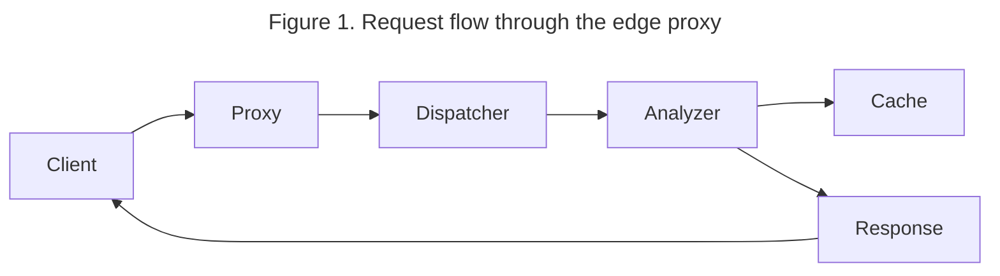
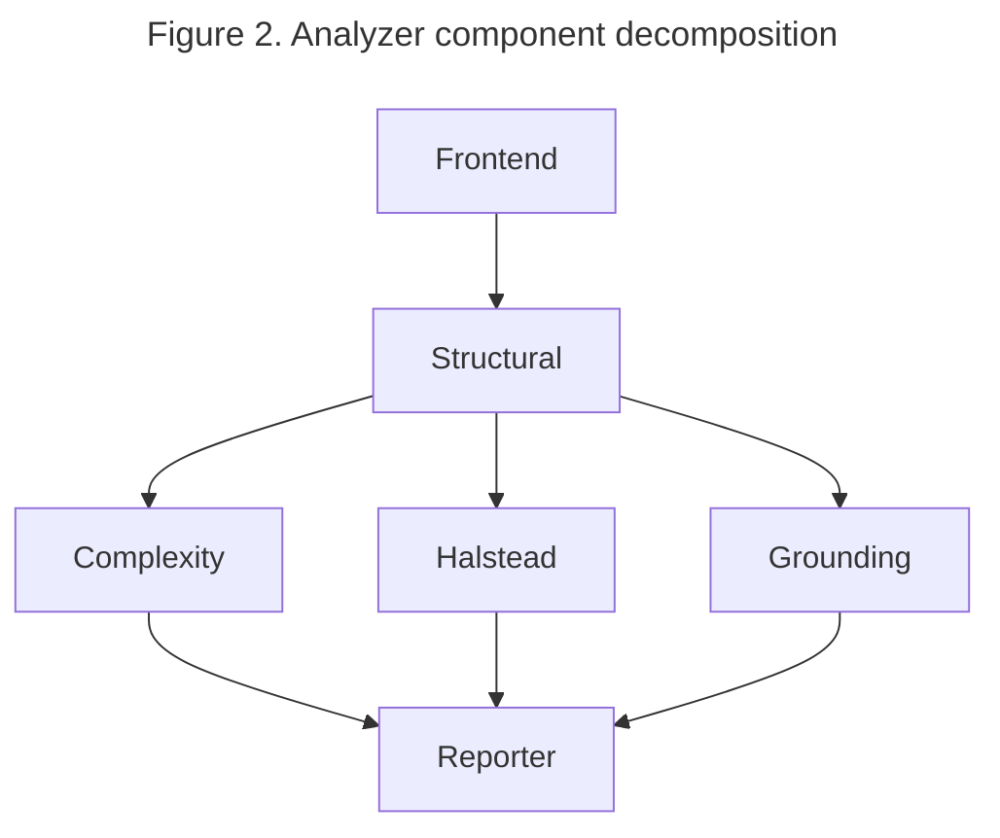
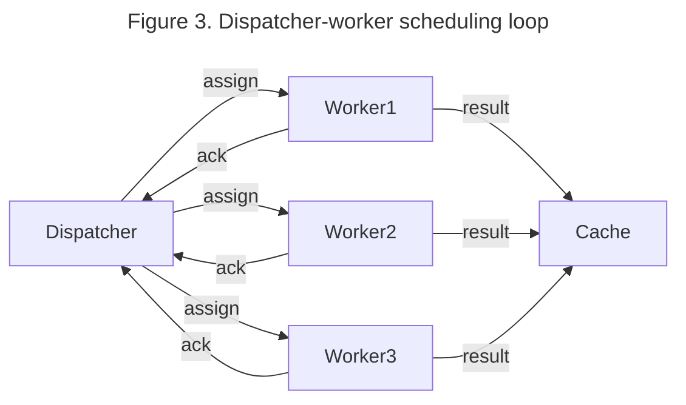
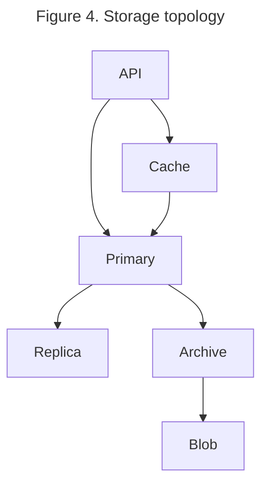
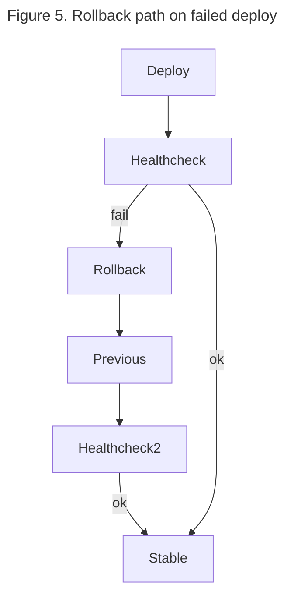

# Runtime architecture

This document describes the high-level runtime architecture of the
`mehen` service and the relationships between its major components.
Five diagrams illustrate request flow, component decomposition,
scheduling, storage topology, and the rollback path. Each diagram
carries a caption and nearby explanatory prose so the visual aid
complements rather than replaces the surrounding text.

## Request flow

The inbound request flow is shown in Figure 1. Requests arrive at the
edge proxy, terminate TLS, and fan out to the analysis pool through
the dispatcher. Responses follow the reverse path. The dispatcher
batches work so that CPU-bound analysis stages amortize overhead
across many small documents.

Readers who need the exact proxy configuration should consult the
operators runbook. The diagram is intentionally high-level; it does
not show retry loops or rate-limiting edges because those are
implementation details that would clutter the architectural picture.

Some additional context: the proxy is a thin layer that primarily
handles TLS termination and HTTP/2 multiplexing. It does not perform
any business logic and is therefore easy to scale horizontally. The
dispatcher in contrast is stateful and coordinates outstanding work
across the analyzer fleet.

## Component decomposition

Figure 2 breaks the analyzer into its major internal components. The
frontend parses the source buffer, the structural pass extracts the
LOC family and section tree, the complexity pass computes MRPC and
MCC, the Halstead pass counts tokens, and the grounding pass resolves
paths and links. The components are not independent — later passes
read data produced by earlier ones — but they are conceptually
separate.

The reporter assembles the final metric record and hands it back to
the dispatcher. The decomposition is useful because it lets us reason
about each pass in isolation and add new passes without perturbing
the existing ones. It also lets us parallelize the three middle passes
when the input document is large enough to justify the extra
scheduling overhead.

Readers familiar with compiler architecture will recognize a loose
analogy: the frontend produces an AST, several analysis passes decorate
the AST with derived data, and a final reporter consumes the decorated
form to emit the public output. The analogy is loose because the AST
here is a tree-sitter parse tree rather than a full compiler IR, but
the overall shape is similar.

## Scheduling

Figure 3 shows how the dispatcher schedules incoming work across the
analyzer pool. When a request arrives the dispatcher assigns it to a
worker based on a weighted round-robin policy that accounts for each
worker's outstanding load. Workers pull work from their queue and
report completion back to the dispatcher. If a worker becomes
unresponsive the dispatcher reassigns its outstanding tasks.

The scheduling policy is tunable. The default weights favor recently
responsive workers which tends to keep latency low under steady load.
Operators can override the weights through a configuration file when
the workload has unusual characteristics that the default policy does
not handle well.

Worker health is tracked through periodic heartbeats. A worker that
misses three consecutive heartbeats is marked suspect and its
outstanding work is reassigned to other workers after a short grace
period. This mechanism is primarily defensive and is rarely triggered
in normal operation.

## Storage topology

Figure 4 shows the storage topology. The system uses three stores: a
primary relational database for metric aggregates and run metadata,
an in-memory cache for hot-path lookup, and a blob store for archived
metric records older than 30 days.

The relational primary is the source of truth. The cache improves read
latency for recent runs and is invalidated whenever the primary is
updated. The archive tier is append-only and is optimized for
long-term cost rather than for query performance. A background job
migrates records older than 30 days from the primary to the archive.

Consistency guarantees differ across the stores. The primary is
strongly consistent, the cache is eventually consistent with a
bounded staleness window, and the archive is effectively immutable
once a record has been migrated. Callers who need strong consistency
should read from the primary directly; callers who can tolerate
slight staleness should read from the cache for lower latency.

## Rollback path

Figure 5 illustrates the rollback path for a failed deploy. The
rollout controller monitors health probes after each deploy. If
health probes fail within the bake window, the controller scales the
new replica set to zero and restores the previous replica set.

The rollback path is intentionally simple. It does not attempt to
repair the failing deploy in place; instead it reverts to a known-good
state and surfaces an alert for operators to investigate. This
conservative policy trades some recovery speed for predictability and
has proved more reliable than more aggressive self-repair strategies
in our experience.

## Summary

The five diagrams together describe the system from five complementary
angles. Request flow explains what happens at runtime; component
decomposition explains how the analyzer is structured internally;
scheduling explains how work is distributed; storage topology explains
where data lives; and the rollback path explains how we recover from
failed deploys. Readers who need deeper detail should consult the
respective source files, which are linked from the architecture
overview page.
