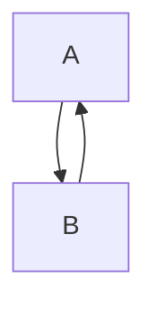

# Diagram Mermaid Fixture

The diagram below encodes the §12.2 two-node cycle invariant referenced in
the Phase-C spec: nodes=2, edges=2, components=1, cycles=1.

A trailing explanation paragraph keeps the nearby-prose flag on so the
diagram has a scaffold credit even without an explicit caption.
