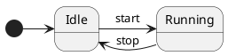

# Diagram Parse Error Fixture

A fenced block labelled with an unknown diagram language ("tikz") goes
through the diagram pipeline but yields `parse_error = true`, adding the
+2.0 diagram-complexity term per §12.2.



```tikz
\node (A) at (0,0) {A};
\node (B) at (1,1) {B};
\draw (A) -- (B);
```
